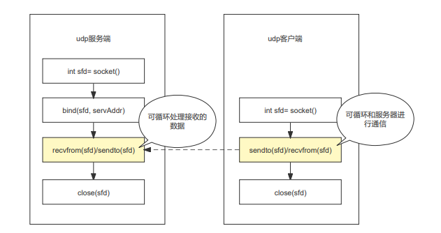

# UDP 编程整理

- 参考链接
  - https://blog.csdn.net/qq_44423388/article/details/124199554
  - [socket 相关函数使用](./../011.socket/readme.md)

## 1. 分析

- socket(AF_INET, SOCK_DGRAM, 0)
  - AF_INET: 使用 ipv4
  - SOCK_DGRAM: 使用不连续不可信赖的数据包连接
  - 0: 传输协议编号，通常此参考不用管它，设为0即可

- udp 服务端和客户端流程



## 2. demo
## 2.1 服务端 demo

```c
#include <stdio.h>
#include <stdlib.h>
#include <unistd.h>
#include <string.h>
#include <assert.h>
#include <sys/socket.h>
#include <netinet/in.h>
#include <arpa/inet.h>

/**
 * 封装一个获取 socket 地址的函数
 */
struct sockaddr_in *socketIpAddress(const char *ip, uint16_t port)
{
    // 使用 malloc 分配内容
    struct sockaddr_in *ipAddr = (struct sockaddr_in *)malloc(sizeof(struct sockaddr_in));
    ipAddr->sin_family = AF_INET;
    ipAddr->sin_port = htons(port);
    ipAddr->sin_addr.s_addr = inet_addr(ip);
    return ipAddr;
}

int main()
{
    // 创建 socket， 获取 socket 文件描述符，不成功返回 -1
    int sockfd = socket(AF_INET, SOCK_DGRAM, 0);
    assert(sockfd != -1);

    // 构建服务器 ip+port
    // struct sockaddr_in servAddr;
    // memset(&servAddr, 0, sizeof(servAddr));
    // servAddr.sin_family = AF_INET;
    // servAddr.sin_port = htons(6000);
    // servAddr.sin_addr.s_addr = inet_addr("127.0.0.1");
    // 绑定服务器 ip+port
    // int res = bind(sockfd, (struct sockaddr *)&servAddr, sizeof(servAddr));
    // assert(res != -1);
    // 构建服务器 ip+port
    struct sockaddr_in *servAddr;
    servAddr = socketIpAddress("127.0.0.1", 6000);
    // 绑定服务器 ip+port
    int res = bind(sockfd, (struct sockaddr *)servAddr, sizeof(*servAddr));
    assert(res != -1);

    // struct sockaddr_in clientAddr;
    // int clientAddrLen = sizeof(clientAddr);
    struct sockaddr_in *clientAddr = (struct sockaddr_in *)malloc(sizeof(struct sockaddr_in));
    int clientAddrLen = sizeof(*clientAddr);

    int recvStatus;  // 保存接受包的状态
    int counter = 0; // 接受数据包个数
    while (1)
    {
        counter++;
        char buff[128] = {0};
        // recvfrom(sockfd, buff, 127, 0, (struct sockaddr *)&clientAddr, &clientAddrLen);
        recvStatus = recvfrom(sockfd, buff, 127, 0, (struct sockaddr *)clientAddr, &clientAddrLen);
        assert(recvStatus != -1);

        // printf("=== 第 %d 次接受数据 === ip: %s, port: %d \n", counter, inet_ntoa(clientAddr.sin_addr), ntohs(clientAddr.sin_port));
        printf("=== 第 %d 次接受数据 === %s:%d \n", counter, inet_ntoa(clientAddr->sin_addr), ntohs(clientAddr->sin_port));
        printf("接受到数据: %s\n", buff);

        char rev[200];
        sprintf(rev, "receive: %s", buff); // 字符串装载
        // 向客户端发送数据
        // sendto(sockfd, rev, strlen(rev), 0, (struct sockaddr *)&clientAddr, sizeof(clientAddr));
        sendto(sockfd, rev, strlen(rev), 0, (struct sockaddr *)clientAddr, clientAddrLen);
    }

    // 关闭服务器的 socket 文件描述符
    close(sockfd);
}
```

## 2.2 客户端 demo

```c

#include <stdio.h>
#include <stdlib.h>
#include <unistd.h>
#include <string.h>
#include <assert.h>
#include <sys/socket.h>
#include <netinet/in.h>
#include <arpa/inet.h>
#include <unistd.h>

extern void readme();
extern void autoSend();
extern void manualSend();

/**
 * 封装一个获取 socket 地址的函数
 */
struct sockaddr_in *socketIpAddress(const char *ip, uint16_t port)
{
    // 使用 malloc 分配内容
    struct sockaddr_in *ipAddr = (struct sockaddr_in *)malloc(sizeof(struct sockaddr_in));
    ipAddr->sin_family = AF_INET;
    ipAddr->sin_port = htons(port);
    ipAddr->sin_addr.s_addr = inet_addr(ip);
    return ipAddr;
}

int main(int argc, char const *argv[])
{
    // 命令参数不是 2 个,直接返回命令操作提示
    if (2 != argc)
    {
        readme();
        return -1;
    }
    // 确保额外参数为1或2
    int sendMode = atoi(argv[1]);
    printf("参数: %d\n", sendMode);
    if (1 != sendMode && 2 != sendMode)
    {
        readme();
        return -1;
    }

    int sockfd = socket(AF_INET, SOCK_DGRAM, 0);
    assert(sockfd != -1);

    struct sockaddr_in *servAddr;
    servAddr = socketIpAddress("127.0.0.1", 6000);

    if (1 == sendMode)
    {
        // 自动发送数据包
        autoSend(sockfd, servAddr);
    }
    else
    {
        // 手动发送数据包
        manualSend(sockfd, servAddr);
    }

    close(sockfd);
}

void readme()
{
    printf("========== 使用说明 START ==========\n");
    printf("该程序是一个 UDP 协议的客户端\n");
    printf("运行时需要一个额外的参数\n");
    printf("  额外参数说明，只支持两种:\n");
    printf("    1: 自动发送内容\n");
    printf("    2: 手动输入发送内容\n");
    printf("========== 使用说明 END   ==========\n");
}

// 数据自动发送
void autoSend(int sockfd, struct sockaddr_in *servAddr)
{
    int count = 0;
    int len = sizeof(*servAddr);
    while (1)
    {
        count++;
        char buff[128];
        sprintf(buff, "第 %d 次发送", count);
        // 向服务端发送数据
        sendto(sockfd, buff, strlen(buff), 0, (struct sockaddr *)servAddr, len);
        memset(buff, 0, 128);

        // 接受服务端的响应
        recvfrom(sockfd, buff, 127, 0, (struct sockaddr *)servAddr, &len);
        printf("响应数据: %s\n", buff);
        usleep(1000000);
    }
}

// 手动发送数据
void manualSend(int sockfd, struct sockaddr_in *servAddr)
{
    int len = sizeof(*servAddr);
    while (1)
    {
        char buff[128] = {0};
        printf("input:\n");
        fgets(buff, 128, stdin);
        if (strncmp(buff, "end", 3) == 0)
        {
            break;
        }
        // 向服务端发送数据
        sendto(sockfd, buff, strlen(buff), 0, (struct sockaddr *)servAddr, len);
        memset(buff, 0, 128);

        // 接受服务端的响应
        recvfrom(sockfd, buff, 127, 0, (struct sockaddr *)servAddr, &len);
        printf("响应数据: %s\n", buff);
    }
}
```

## 3. 测试效果

- 编译生成服务端和客户端

```shell
ghostcloud@gc:/code/capp/cplus-doc/090.projects/012.udp$ make clean
rm -f  client.o  server.o server.out client.out
ghostcloud@gc:/code/capp/cplus-doc/090.projects/012.udp$ make
cc -c server.c -o server.o
cc server.o -o server.out
cc -c client.c -o client.o
cc client.o -o client.out
```

- 服务端启动

```shell
ghostcloud@gc:/code/capp/cplus-doc/090.projects/012.udp$ ./server.out 
=== 第 1 次接受数据 === 127.0.0.1:54277 
接受到数据: 第 1 次发送
=== 第 2 次接受数据 === 127.0.0.1:54277 
接受到数据: 第 2 次发送
=== 第 3 次接受数据 === 127.0.0.1:54277 
接受到数据: 第 3 次发送
=== 第 4 次接受数据 === 127.0.0.1:54153 
接受到数据: test

=== 第 5 次接受数据 === 127.0.0.1:54153 
接受到数据: good

```

- 客户端启动

```shell
ghostcloud@gc:/code/capp/cplus-doc/090.projects/012.udp$ ./client.out 3
参数: 3
========== 使用说明 START ==========
该程序是一个 UDP 协议的客户端
运行时需要一个额外的参数
  额外参数说明，只支持两种:
    1: 自动发送内容
    2: 手动输入发送内容
========== 使用说明 END   ==========
ghostcloud@gc:/code/capp/cplus-doc/090.projects/012.udp$ ./client.out 1
参数: 1
响应数据: receive: 第 1 次发送
响应数据: receive: 第 2 次发送
响应数据: receive: 第 3 次发送

ghostcloud@gc:/code/capp/cplus-doc/090.projects/012.udp$ ./client.out 2
参数: 2
input:
test
响应数据: receive: test

input:
good
响应数据: receive: good

input:
```

## 100. 其他

- 封装一个获取 socket 地址的函数

```c
struct sockaddr_in *socketIpAddress(const char *ip, uint16_t port)
{
    // 使用 malloc 分配内容
    struct sockaddr_in *ipAddr = (struct sockaddr_in *)malloc(sizeof(struct sockaddr_in));
    ipAddr->sin_family = AF_INET;
    ipAddr->sin_port = htons(port);
    ipAddr->sin_addr.s_addr = inet_addr(ip);
    return ipAddr;
}
```
