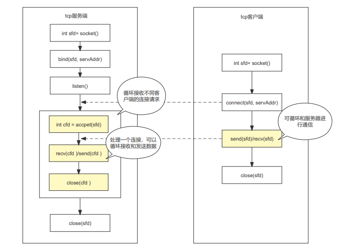

# c语言 tcp 编程整理

- 参考链接
  - https://blog.csdn.net/qq_44423388/article/details/112983545
  - [socket 相关函数使用](./../011.socket/readme.md)

## 1. 分析

- socket(AF_INET, SOCK_DGRAM, 0)
  - AF_INET: 使用 ipv4
  - SOCK_DGRAM: 使用不连续不可信赖的数据包连接
  - 0: 传输协议编号，通常此参考不用管它，设为0即可

- tcp 服务端和客户端流程



## 2. demo
## 2.1 服务端 demo

```c
#include <stdio.h>
#include <stdlib.h>
#include <assert.h>
#include <unistd.h>
#include <string.h>

#include <sys/types.h>
#include <sys/socket.h>
#include <netinet/in.h>
#include <arpa/inet.h>

/**
 * 封装一个获取 socket 地址的函数
 */
struct sockaddr_in *socketIpAddress(const char *ip, uint16_t port)
{
    // 使用 malloc 分配内容
    struct sockaddr_in *ipAddr = (struct sockaddr_in *)malloc(sizeof(struct sockaddr_in));
    ipAddr->sin_family = AF_INET;
    ipAddr->sin_port = htons(port);
    ipAddr->sin_addr.s_addr = inet_addr(ip);
    return ipAddr;
}

int main()
{
    //创建用于监听的套接字，这个套接字是一个文件描述符，用于检测有没有客户端发起一个新的连接
    int listenfd = socket(AF_INET, SOCK_STREAM, 0);
    assert(listenfd != -1);

    struct sockaddr_in *servAddr = socketIpAddress("127.0.0.1", 6000);
    // 将得到的监听的文件描述符和本地的IP端口进行绑定
    int res = bind(listenfd, (struct sockaddr *)servAddr, sizeof(*servAddr));
    assert(res != -1);

    // 设置监听(成功之后开始监听，监听的是客户端的连接)
    res = listen(listenfd, 5);
    assert(res != -1);

    int counter = 0;
    // 定义接收到客户的 socket 地址
    struct sockaddr_in *clientAddr = (struct sockaddr_in *)malloc(sizeof(struct sockaddr_in));
    socklen_t clientAddrLen = sizeof(struct sockaddr_in);

    while (1)
    {
        counter++;
        // 接收到客户端请求
        int c = accept(listenfd, (struct sockaddr *)clientAddr, &clientAddrLen);
        if (c == -1)
        {
            printf("Get One Client Link Error\n");
            continue;
        }

        while (1)
        {
            char buff[128] = {0};
            printf("buff: %s\n", buff);
            int n = recv(c, buff, 127, 0); //读取数据放在buff中，一次读取127个
            if (n <= 0)
            {
                printf("Client will unlink\n");
                break;
            }
            printf("第 %d 次接受 accept(%d) 数据: (%s)\n", counter, c, buff);

            char rep[200];
            sprintf(rep, "响应: %s", buff);
            send(c, rep, strlen(rep), 0);
        }
        close(c);
    }

    //断开连接，关闭套接字（四次挥手）
    close(listenfd);
    return 0;
}
```

## 2.2 客户端 demo

```c
#include <stdio.h>
#include <stdlib.h>
#include <assert.h>
#include <unistd.h>
#include <string.h>
#include <sys/types.h>
#include <sys/socket.h>
#include <netinet/in.h>
#include <arpa/inet.h>
#include <unistd.h>

extern void readme();
extern void autoSend();
extern void manualSend();

/**
 * 封装一个获取 socket 地址的函数
 */
struct sockaddr_in *socketIpAddress(const char *ip, uint16_t port)
{
    // 使用 malloc 分配内容
    struct sockaddr_in *ipAddr = (struct sockaddr_in *)malloc(sizeof(struct sockaddr_in));
    ipAddr->sin_family = AF_INET;
    ipAddr->sin_port = htons(port);
    ipAddr->sin_addr.s_addr = inet_addr(ip);
    return ipAddr;
}

int main(int argc, char const *argv[])
{
    // 参数判断
    if (2 != argc)
    {
        readme();
        return -1;
    }
    int sendMode = atoi(argv[1]);
    printf("参数: %d\n", sendMode);
    if (1 != sendMode && 2 != sendMode)
    {
        readme();
        return -1;
    }

    //创建一个通信的套接字，需要指定服务器的IP和端口号y
    int sockfd = socket(AF_INET, SOCK_STREAM, 0);
    assert(sockfd != -1);

    struct sockaddr_in *servAddr = socketIpAddress("127.0.0.1", 6000);

    //连接服务器，需要知道服务器绑定的IP和端口
    int res = connect(sockfd, (struct sockaddr *)servAddr, sizeof(*servAddr));
    assert(res != -1);

    //通信
    if (1 == sendMode)
    {
        autoSend(sockfd); // 自动发送
    }
    else
    {
        manualSend(sockfd); // 手动发送
    }
    //断开连接
    close(sockfd);
    return 0;
}

// 工具介绍
void readme()
{
    printf("========== 使用说明 START ==========\n");
    printf("该程序是一个 TCP 协议的客户端\n");
    printf("运行时需要一个额外的参数\n");
    printf("  额外参数说明，之支持两种:\n");
    printf("    1: 自动发送内容\n");
    printf("    2: 手动输入发送内容\n");
    printf("========== 使用说明 END   ==========\n");
}

// 数据自动发送
void autoSend(int sockfd)
{
    int count = 0;
    while (1)
    {
        count++;

        char buff[128];
        sprintf(buff, "第%d次发送", count);
        send(sockfd, buff, strlen(buff), 0); //\n不发

        memset(buff, 0, 128);
        recv(sockfd, buff, 127, 0);
        printf("响应数据: %s\n", buff);
        usleep(1000000);
    }
}

// 数据手动发送
void manualSend(int sockfd)
{
    while (1)
    {
        printf("输入发送数据: ");
        char buff[128] = {0};
        fgets(buff, 127, stdin);
        if (strncmp(buff, "end", 3) == 0)
        {
            break;
        }

        send(sockfd, buff, strlen(buff) - 1, 0); //\n不发

        memset(buff, 0, 128);
        recv(sockfd, buff, 127, 0);
        printf("响应数据: %s\n", buff);
    }
}
```

## 3. 测试效果

- 编译生成服务端和客户端

```shell
ghostcloud@gc:/code/capp/cplus-doc/090.projects/013.tcp$ make clean
rm -f  client.o  server.o server.out client.out
ghostcloud@gc:/code/capp/cplus-doc/090.projects/013.tcp$ make
cc -c server.c -o server.o
cc server.o -o server.out
cc -c client.c -o client.o
cc client.o -o client.out
```

- 服务端启动

```shell
ghostcloud@gc:/code/capp/cplus-doc/090.projects/013.tcp$ ./server.out 
buff: 
第 1 次接受 accept(4) 数据: (第1次发送)
buff: 
第 1 次接受 accept(4) 数据: (第2次发送)
buff: 
第 1 次接受 accept(4) 数据: (第3次发送)
buff: 
Client will unlink
buff: 
第 2 次接受 accept(4) 数据: (test)
buff: 
第 2 次接受 accept(4) 数据: (ddd)
buff: 
Client will unlink

```

- 客户端启动

```shell
ghostcloud@gc:/code/capp/cplus-doc/090.projects/013.tcp$ ./client.out 
========== 使用说明 START ==========
该程序是一个 TCP 协议的客户端
运行时需要一个额外的参数
  额外参数说明，之支持两种:
    1: 自动发送内容
    2: 手动输入发送内容
========== 使用说明 END   ==========

ghostcloud@gc:/code/capp/cplus-doc/090.projects/013.tcp$ ./client.out 1
参数: 1
响应数据: 响应: 第1次发送
响应数据: 响应: 第2次发送
响应数据: 响应: 第3次发送

ghostcloud@gc:/code/capp/cplus-doc/090.projects/013.tcp$ ./client.out 2
参数: 2
输入发送数据: test
响应数据: 响应: test
输入发送数据: ddd 
响应数据: 响应: ddd
输入发送数据:
```
