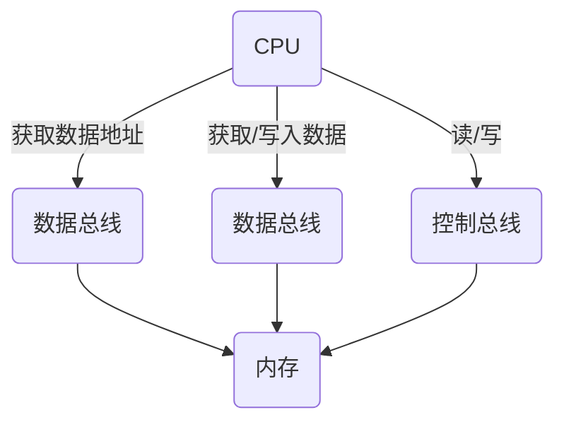

# 计算机知识

## 1. 计算机主要元器件
- CPU: 运算功能
- 内存: 内部存储器(相对于内存)
  - 相对于硬盘读写输入更快，断电或重启数据丢失
- 硬盘: 外部存储器
  - ssd 硬盘
  - 机械硬盘
  - 没有硬盘电脑可启动进入 bios
- 键盘/鼠标: 输入设备
- 显示器: 输出设备
- GPU: 显卡
  - 相比较于CPU更擅长精度计算（小数）

## 2. CPU和内存数据交互

- 32位 CPU 有 32 条地址总线，寻址的最大为 $2^{32}$ B = $2^{22}$ KB = $2^{12}$MB  = $2^2$ GB = 4GB
  - 所以，32位CPU最大支持4GB，插入大于4GB的内存是浪费的
- 64位 CPU 有 64 条地址总线，地址总线最大支持 $2^{64}$ B